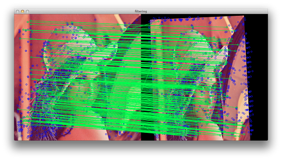

filter_framework
================

Contain simple methods for filtering matches for features2d OpenCV module

Compilation
================

The project is based on CMake tool, so you can build it on any supported platform.

Firstly you should install OpenCV library. The code was tested with OpenCV 2.4.

Unix way:

```
git clone https://github.com/alekcac/filter_framework
mkdir filter-build
cd filter-build/
cmake ../filter_framework/
make
```

Using
================

Configuration file
----------------
```
cp ../filter_framework/resources/lena.jpg ./
./filter_framework -conf ../filter_framework/resources/config.xml 
```

Configuration file format:

```
<?xml version="1.0"?>
<opencv_storage>
<detector>SURF</detector>
<descriptor>SURF</descriptor>
<matcher>BruteForce-L1</matcher>
<visible>1</visible>
<mode>0</mode>
<queryImage>lena.jpg</queryImage>
<trainImage>lena.jpg</trainImage>
<knn>2</knn>
<iterCount>-1</iterCount>
<filter>
  <_><filterName>RatioCheck</filterName>
	<param>0.8</param></_>
  <_><filterName>KnotCheck</filterName></_>
</filter>
</opencv_storage>
```

Command line arguments
--------------------
```
./filter_framework -det SURF -desc SURF -matcher BruteForce -verbose 1 -image ../filter_framework/resources/lena.jpg -filter RatioCheck
```

Use Space to go to the next iteration, Esc to exit.

Output
================

Application iteratively change input image with random homography. After that it calculates features and descriptors on initial and modified images and matches them. Then few filtering techniques can be applied. 

Output of each iteration:

```
<the ratio of correct matches to all before filtering> <the ratio of correct matches to all after filtering> <the ratio of correct matches after filtering to all correct matches>
```

Also it displays two windows with results of matching without filtering:

and filtered mathes:

